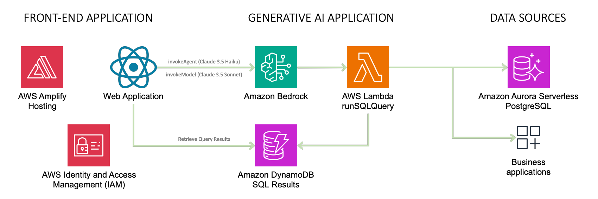

# Tutorial to Deploy the Data Analyst Assistant for Video Game Sales Using Amazon Bedrock Agents

This solution provides a Generative AI Application reference that is able to access structured data stored in a PostgreSQL database based on a question-answering assistant that generates SQL queries to obtain the necessary data to provide an answer in natural language.

> [!NOTE] 
> To get started, [follow the tutorial on deploying the latest solution update published in the **Amazon Bedrock Agent Samples** repository on AWS Labs GitHub](https://github.com/awslabs/amazon-bedrock-agent-samples/tree/main/examples/agents/video_games_sales_assistant_with_amazon_bedrock_agents).

